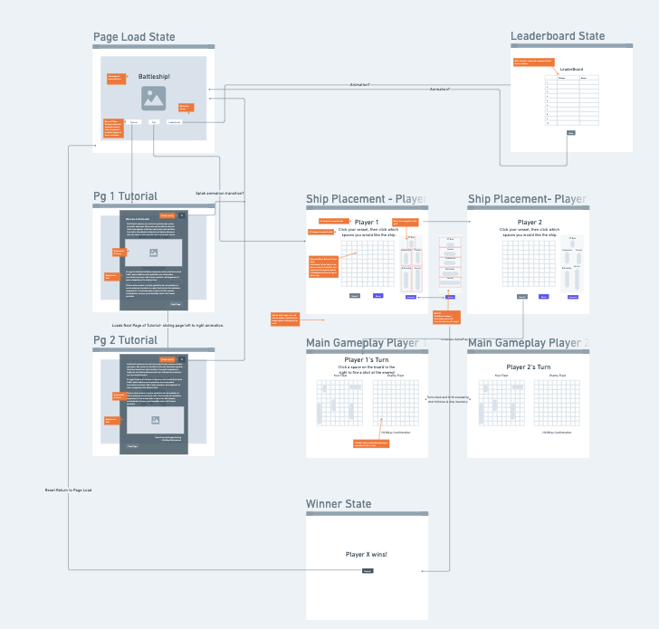

# Battleship

[Play the Game](https://bootsstribling.github.io/Battleship/)

## About the creation: 
I started this game with the intention of diving into a very difficult game for my beginner level and working hard to learn what was needed to produce something fun with a few twists. Having one week to complete this project, I definitely found my struggle and stride throughout its creation. Execution is the most difficult part of any project and I found myself ice-boxing items I never would have expected to ice-box. I hope you enjoy the game as is. I'm continuing to adjust, fix bugs, and add features. Enjoy Battleship from Boots Stribling!

## Technologies Used:
- HTML5
- CSS
- JavaScript
- Bootstrap CSS Framework  

### Credits
1. [Joe Malatesta](https://github.com/JoeMalatesta)
2. [David Stinson](https://github.com/DavidStinson)
3. [Emily Lascano](https://github.com/e-lascano2021)
4. [Hunter Long](https://github.com/whlong1)
5. [Battleship Favicon](https://www.vectorstock.com/royalty-free-vector/battleship-team-logo-vector-38208431)
6. [Water Background](https://unsplash.com/photos/qEswHvOmi1c)
7. [Battleship Photo](https://www.wowsbuilds.com/ships/alaska)

### Original WireFrame: 

### IceBox Items:
- [ ] Tutorial MODL PG 1 && 2
  
- [ ] Render P1 shots on P2ship board and vice versa 

- [ ]  LeaderBoard State with ranking and scoring

- [ ]  Audio of Missle launch with hit or miss conditional audio

- [ ]  Audio of ship placement completion - ding of ship bell, saluting, sonar, airplane takeoff, (battleship conditional audio)

- [ ]  gif of water moving as background with nearly invisible grid in CSS to emphasize the waters

- [ ]  conditional animation of hit or miss on player click of shot board

- [ ]  missle/shot arc animation in CSS from existing ship location(not sunk) of player to shot location and animation following that sequentially

- [ ]  timer with punishment for delay of game being a hit on an existing ship

- [ ]   page state between page load state and ship placement state to allow players to type custom names for use throughout the rest of the game and saved if high score to leaderboard