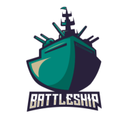

# Battleship

Insert Gameplay Image Here

About: 

Click here to Play the game:  https://bootsstribling.github.io/Battleship/

##Technologies Used:
- HTML5
- CSS
- JavaScript
- Bootstrap CSS Framework  

Original WireFrame: 

[OG Wireframe](assets/OG-Wireframe))

IceBox Items:
-Tutorial MODL PG 1 && 2

- LeaderBoard State with ranking and scoring

- Audio of Missle launch with hit or miss conditional audio

- Audio of ship placement completion- ding of ship bell, saluting, sonar, airplane takeoff, (battleship conditional audio)

- gif of water moving as background with nearly invisible grid in CSS to emphasize the waters

- conditional animation of hit or miss on player click of shot board

- missle/shot arc animation in CSS from existing ship location(not sunk) of player to shot location and animation following that sequentially

- timer with punishment for delay of game being a hit on an existing ship

-  page state between page load state and ship placement state to allow players to type custom names for use throughout the rest of the game and saved if high score to leaderboard